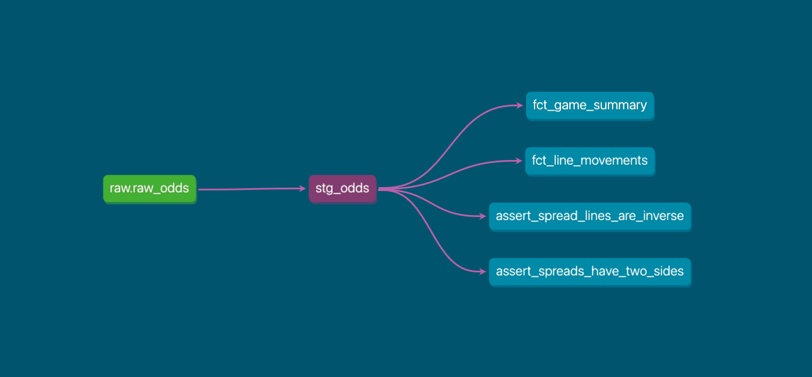

# NFL Market Movement Tracker

This project tracks how NFL market lines move across operators leading up to kickoff throughout the 2025-2026 season. Built as an ELT pipeline using Python, DuckDB, and dbt, with a Streamlit dashboard for visualization.

## Background

```
The Odds API → Python Extract → JSON Files → Python Load → DuckDB → dbt Transform → Streamlit Dashboard
```

I pulled historical odds from [The Odds API](https://the-odds-api.com/) 4 times per day (8am, 12pm, 4pm, 8pm CT) for each operator throughout the entirety of the 2025-2026 NFL season. The data is loaded into DuckDB and transformed with dbt.

## Dataset

1.8M+ rows covering the full 2025-2026 NFL season with spreads, totals, and head to head market data from 30+ operators including DraftKings, FanDuel, BetMGM, BetRivers, Pinnacle, Hard Rock Bet, and others. 636 total snapshots were captured throughout the season.

## dbt Models

**Staging**
- `stg_odds` — cleaned and renamed raw odds data, filtered to pre-match captures only

**Marts**
- `fct_line_movements` — snapshot level odds with line/price changes from previous capture and implied probability
- `fct_game_summary` — one row per game/operator/market with opening and closing lines, prices, implied probabilities, and total movement

**Tests**
- `not_null` and `accepted_values` on staging columns
- Custom tests validating that every spread has two sides and lines are properly inverse (+3 / -3)

## dbt Lineage



## Dashboard

[Live Dashboard](https://nfl-market-movement-tracker-a2fnqqz4jfhdlbzxhzvx9q.streamlit.app/)

Select any NFL week and game or by team schedule to analyze spreads, totals, and head to head details.

## Instructions to Run Locally

Download the DuckDB database from the [Releases page](https://github.com/bobby-king3/nfl-market-movement-tracker/releases) and place it in the `data/` folder. No API key is needed to run the dbt models or dashboard.

```bash
git clone https://github.com/bobby-king3/nfl-market-movement-tracker.git
cd nfl-market-movement-tracker

python3 -m venv venv
source venv/bin/activate
pip install -r requirements.txt
```

> **Note:** dbt requires a profile in `~/.dbt/profiles.yml`. Add the following entry before running `dbt build`:
> ```yaml
> transform:
>   target: dev
>   outputs:
>     dev:
>       type: duckdb
>       path: /path/to/nfl-market-movement-tracker/data/nfl_odds.duckdb
> ```

```bash
cd transform
dbt build

cd ..
streamlit run dashboard.py
```

## Running the Full Pipeline

If you want to run the extract yourself, an [Odds API](https://the-odds-api.com/) account and API key is required.

```bash
# From the project root
echo "ODDS_API_KEY=your_key_here" > .env

cd extract
python historical_extract.py

cd ../load
python load_to_duckdb.py

cd ../transform
dbt build

cd ..
streamlit run dashboard.py
```

## Planned Future Work
- For the 2026-2027 season and beyond, add orchestration to automate live data ingestion rather than relying on a full historical data pull. 
- The historical odds endpoint costs significantly more credits per request, so using the standard odds endpoint will allow for more frequent data snapshots.

## Disclaimer

This project is for educational and portfolio purposes only. It is not intended to be used for wagering decisions.
